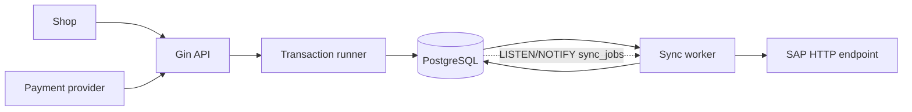
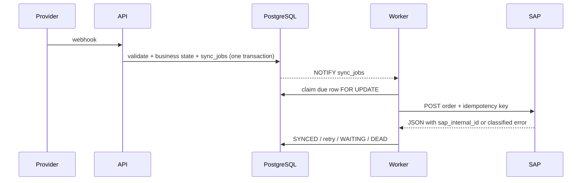

# Architecture

## Responsibilities

`cmd/order-sync` loads configuration, opens the PostgreSQL pool, runs the embedded canonical migration, wires repositories and services, starts Gin, and starts the sync worker. `internal/app` owns routing, request IDs, webhook auth, and HTTP error mapping. `internal/shop`, `internal/payment`, and `internal/orders` contain webhook normalization, validation, reconciliation, and domain rules. `internal/infrastructure/postgres` implements repositories; `internal/infrastructure/sap` implements the outbound HTTP client; `internal/sync` owns durable job claiming and delivery.

The canonical schema is [001_initial.sql](../migrations/001_initial.sql). This repository intentionally has one current schema rather than compatibility migrations.

## Event and delivery flow

Shop events are decoded, normalized, and validated before their immutable business payload is compared by `order_id`; matching new event IDs are accepted as replays, while changed order contents conflict. Payment event IDs are deduplicated independently in the same event table. A previously stored completed payment is linked to the new order and schedules SAP delivery in the same transaction.

Payment events are persisted even when the shop order has not arrived. `PENDING` and `FAILED` remain mutable by `reference_order_id`; `COMPLETED` and `CANCELLED` are terminal, with same-status replays as no-ops. If the order exists, a completed payment marks it paid and creates the outbox job. When the shop event arrives later, reconciliation completes the link. Non-completed payments do not mark an order paid.

`sync_jobs` is a transactional outbox: the job is created with business state, and a PostgreSQL trigger publishes its ID on `sync_jobs`. Notification wakes the worker, while scheduled polling ensures notifications are not required for correctness.

## Boundaries and environments

Production storage is PostgreSQL with JSONB webhook payloads, row locks, and `LISTEN/NOTIFY`. Integration tests use an isolated PostgreSQL 17 Testcontainer and the same repository/migration behavior; they do not use SQLite. Unit tests use fakes and `httptest` servers. The sibling `order-sync-helper` stack is outside this repository boundary and supplies mock SAP, dashboard, and Adminer for local use.

Concurrent workers claim due jobs transactionally, so one job is processed by one claimant at a time. A stale `PROCESSING` job is made claimable again during startup/reconciliation. The persisted `due_at` is the earliest scheduling target; actual SAP delivery can be slightly later because of worker scheduling, database latency, and network latency. SAP delivery is at-least-once from the service’s perspective: the client sends the job identity as the idempotency key, and persistence after a successful call can be retried. If the service crashes after SAP accepts the request but before `SYNCED` is recorded, avoiding a duplicate depends on SAP honoring that idempotency key. An operator can explicitly replay a `DEAD` job by ID with the admin CLI; the command resets the delivery metadata and makes it immediately due as fresh `PENDING` work. See the [operations runbook](operations.md#replay-a-dead-synchronization-job).
