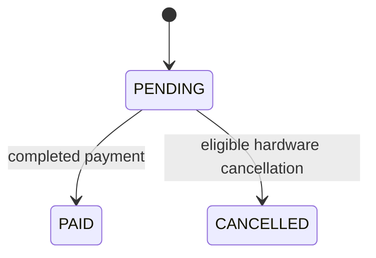
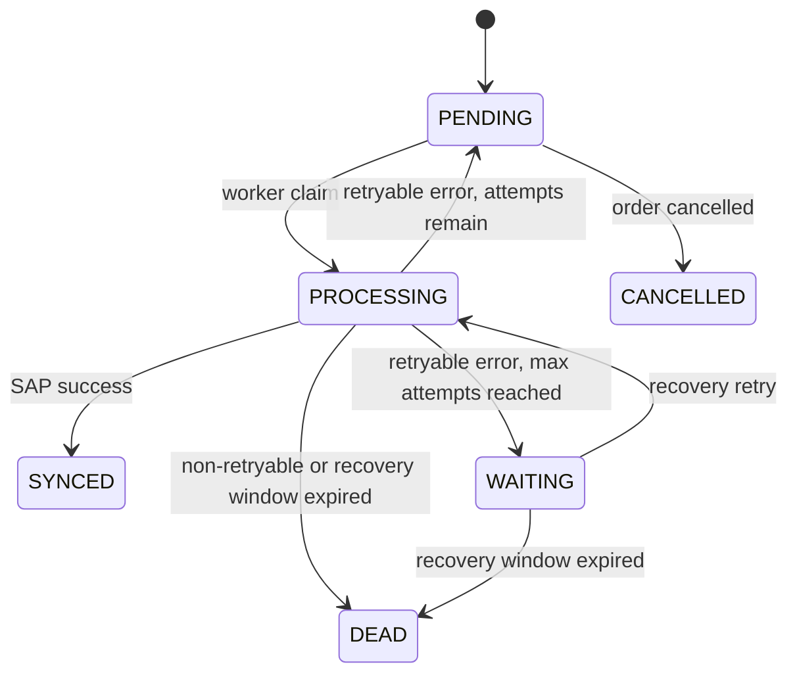

# Domain behavior

## Entities and statuses

An order has `order_id`, customer email, items, payment/order state, and a one-to-one synchronization job. An item has `sku`, positive `quantity`, non-negative `price`, and optional `isHardware`. A payment stores the latest provider status and may temporarily have no linked order. A webhook event ID is unique only within its webhook type.

Order status is `PENDING`, `PAID`, or `CANCELLED`. Payment status is `PENDING`, `COMPLETED`, `FAILED`, or `CANCELLED`. Sync status is `PENDING`, `PROCESSING`, `SYNCED`, `WAITING`, `DEAD`, or `CANCELLED`. Payment `FAILED` is a provider business state; sync `DEAD` means SAP delivery is terminal and is separate.

## SKU classification and timing

The canonical catalog seeds `NUKI-SL3` and `NUKI-BRIDGE` as `HARDWARE`, and `NUKI-SMART-HOSTING` as `DIGITAL`. Unknown SKUs are non-hardware. If any item is classified as hardware, the persisted sync due time is now plus `HARDWARE_SYNC_DELAY_SECONDS`; otherwise it is immediate. The worker guarantees no dispatch before the persisted due time, then dispatches as promptly as possible. This is not an exact-timing guarantee: worker recovery, database work, and network latency can make actual delivery later. Dispatch lag and SAP request duration are emitted as structured log fields. An item-level `isHardware: true` override forces hardware behavior. A false override does not erase a catalog hardware classification.

## Reconciliation and idempotency

Payment-before-order is supported: the payment is stored by `reference_order_id`, then linked when the shop event creates the order. A completed payment triggers `PAID` and scheduling exactly once through transactional repository operations.

Idempotency is field-aware. `order_id` identifies immutable shop data: a new event ID is accepted as a replay only when the customer email and each item’s SKU, quantity, price, and `isHardware` override match the stored order; otherwise it conflicts. `reference_order_id` identifies payment state: `PENDING` and `FAILED` updates remain mutable, while `COMPLETED` and `CANCELLED` are terminal. The same terminal status is a no-op; any later different status conflicts. Event IDs and payment timestamps are processing metadata and do not alter those business decisions.

Cancellation is idempotent for an already-canceled eligible order. Digital-only orders cannot be cancelled; finalized payments and otherwise ineligible orders return a conflict. Cancellation cancels a pending synchronization job and cannot undo a completed/finalized payment.

## Retry semantics

`SAP_ATTEMPTS_BEFORE_WAITING` controls when a retryable job enters recovery mode. `SAP_MAX_ATTEMPTS` is a hard limit on total SAP delivery attempts, including the initial attempt; it defaults to `5`. A job becomes `DEAD` once that limit is reached, even if the recovery window has not expired.

Retryable SAP transport failures and HTTP 429, 500, 502, 503, and 504 responses use exponential delays of 1s, 2s, 4s ... capped at 60s. Non-retryable HTTP responses, malformed SAP responses, and ordinary cancellation errors become `DEAD` immediately. After the configured number of attempts, a retryable job enters `WAITING`; it can recover until `SAP_RECOVERY_WINDOW_SECONDS` from `waiting_since`, after which it becomes `DEAD`. An operator can explicitly replay a `DEAD` job by ID with the admin CLI. Replay clears the prior delivery metadata, resets attempts, and makes the job immediately due as fresh `PENDING` work; a missing or non-`DEAD` job is rejected. SAP-side idempotency history must be checked first because delivery is at-least-once.
